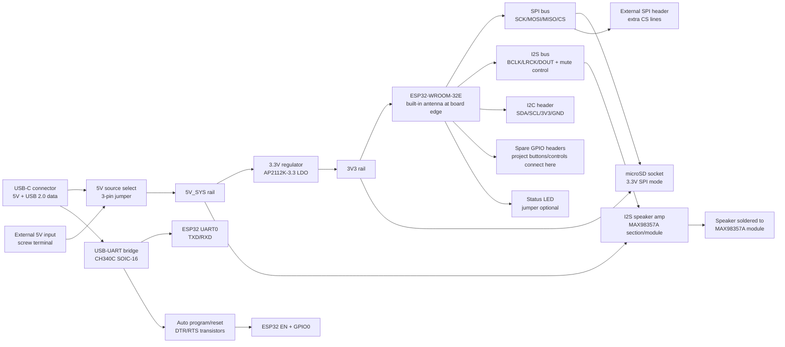

# Rev A Block Diagram

## System Diagram



## Physical Layout Concept

```text
+------------------------------------------------------------------+
| ESP32-WROOM-32E                                                  |
| [PCB antenna end at board edge / copper keepout]                 |
|                                                                  |
|        GPIO headers                         I2C / SPI headers    |
|                                                                  |
| USB-C  USB-UART   EN/BOOT buttons      microSD socket            |
|                                                                  |
| 5V input  source select  3V3 regulator   I2S amp module header   |
+------------------------------------------------------------------+
```

## Layout Rules We Care About

- Put the ESP32 antenna at the PCB edge, preferably with the antenna portion outside
  the main board outline or at least over a no-copper keepout.
- Keep copper, traces, headers, screws, speaker wires, and power wires away from the
  antenna keepout.
- Keep SD traces short, especially `CLK`.
- Add SD pull-ups at the socket, not somewhere far away on a breadboard.
- Put decoupling capacitors next to the SD socket, ESP32 module, regulator, and amp.
- Keep speaker current loops away from the ESP32 antenna and SD traces.
- Use wide traces or pours for `5V_SYS`, `3V3`, and ground.
- Use many ground vias near power sections and connectors.

## Rev A Power Concept

For the first revision, use a simple source selector:

```text
USB_VBUS ----+
             +-- 3-pin jumper + shunt --> 5V_SYS
EXT_5V  -----+
```

This is intentionally simple. It prevents backfeeding the Mac/USB port from the bench
PSU and makes power debugging obvious. A later revision can use an ideal-diode mux if
automatic source switching becomes important.
